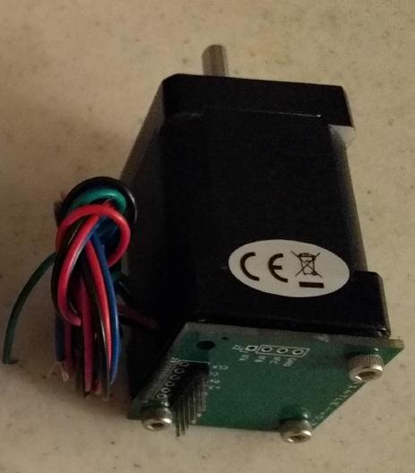

This is an experimental pcb design for a TLE5012B angle sensor mounted
on the back of a NEMA14 stepper motor.

This is an experiment. There is no support for this project.

The original design of the board is from Voron user "JNP".

The PCB design files can be found in the [pcb/](pcb/) directory.  The
boards were designed using [KiCad](https://kicad-pcb.org/) and
manufactured using [JLC PCB](https://jlcpcb.com/).

There is some information on the magnet mounting procedure in the
[magnet document](docs/magnet.md).
